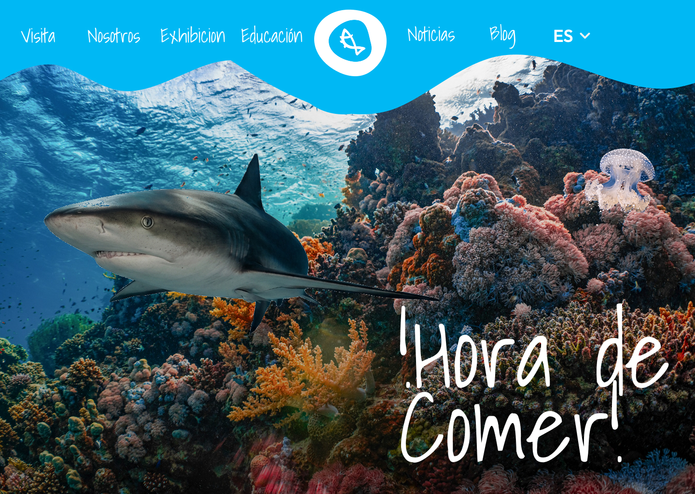

# L'Aquàrium Barcelona Redesign



## Disclaimer

> [!IMPORTANT]
> This is a personal, non-commercial project created solely for educational and portfolio purposes. The images, brands, and visual assets belong to **L'Aquàrium de Barcelona** and are used here only to demonstrate web design and frontend development skills.

## Description

A modern redesign of the official L'Aquàrium de Barcelona website. The goal is to build a modern, visually stunning, and user-friendly interface that adapts to all devices and delivers an optimal user experience.

## Tech Stack & Architecture

This project is built using a **monolithic architecture** with **Next.js**, combining both the frontend and backend in a single codebase.

- **Frontend**: React, Next.js (App Router), Tailwind CSS, GSAP (for premium animations).
- **Backend**: Next.js API Routes & Server Actions to handle backend logic, authentication, and database operations.
- **Database / Auth**: Managed within the Next.js ecosystem for seamless deployment and unified developer experience.

## Installation

```bash
git clone https://github.com/StephenDC-UwU/redesign-laquarium-barcelona.git
cd redesign-laquarium-barcelona
npm install
npm run dev
```

## Usage

```bash
npm run dev
```

## Author

[StephenDC-UwU](https://github.com/StephenDC-UwU)
